# FileStore Architecture Documentation

This document provides visual representations of the FileStore architecture and data flow patterns in the Otomi API.

## Table of Contents
1. [High-Level Architecture](#1-high-level-architecture)
2. [Object Transformation Flow](#2-object-transformation-flow)
3. [CRUD Operation Flows](#3-crud-operation-flows)
4. [Secret File Handling](#4-secret-file-handling)
5. [FileStore Load Process](#5-filestore-load-process)
6. [File Path Generation](#6-file-path-generation)

---

## 1. High-Level Architecture

This diagram shows the relationship between key components and data types.

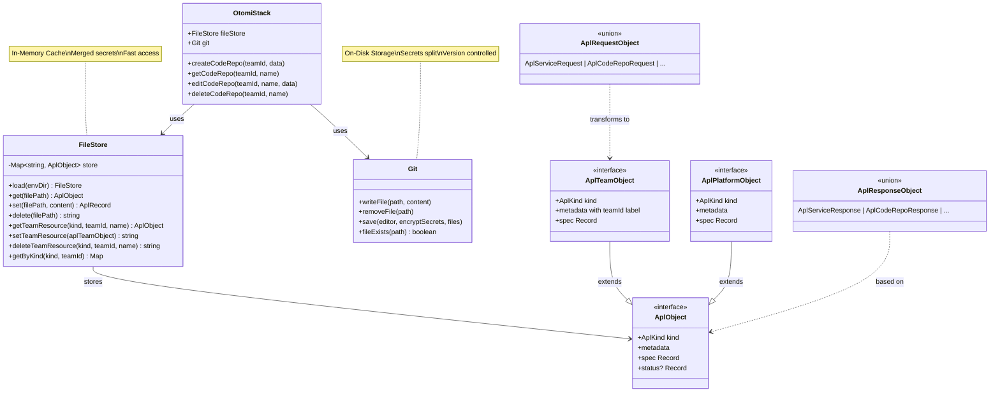

---

## 2. Object Transformation Flow

This diagram shows how objects transform as they move through the system.

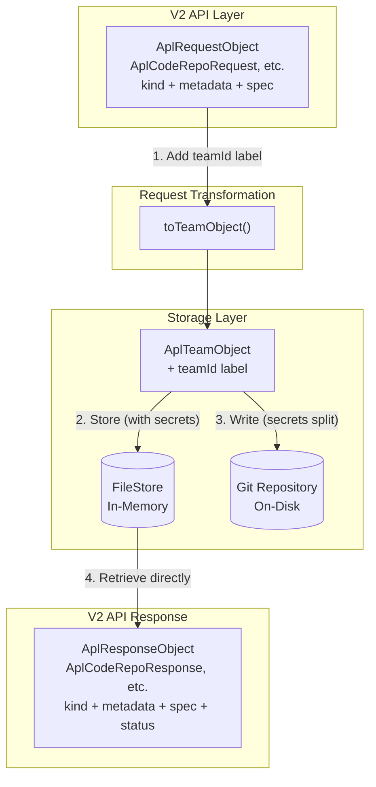

---

## 3. CRUD Operation Flows

### 3.1 CREATE Flow

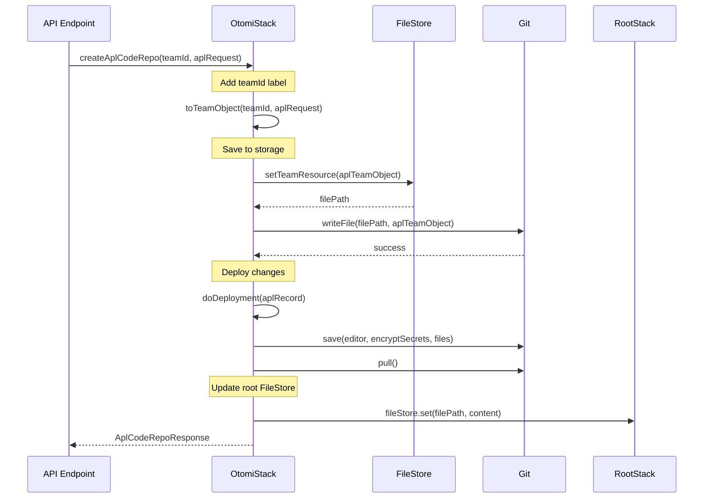

### 3.2 READ Flow

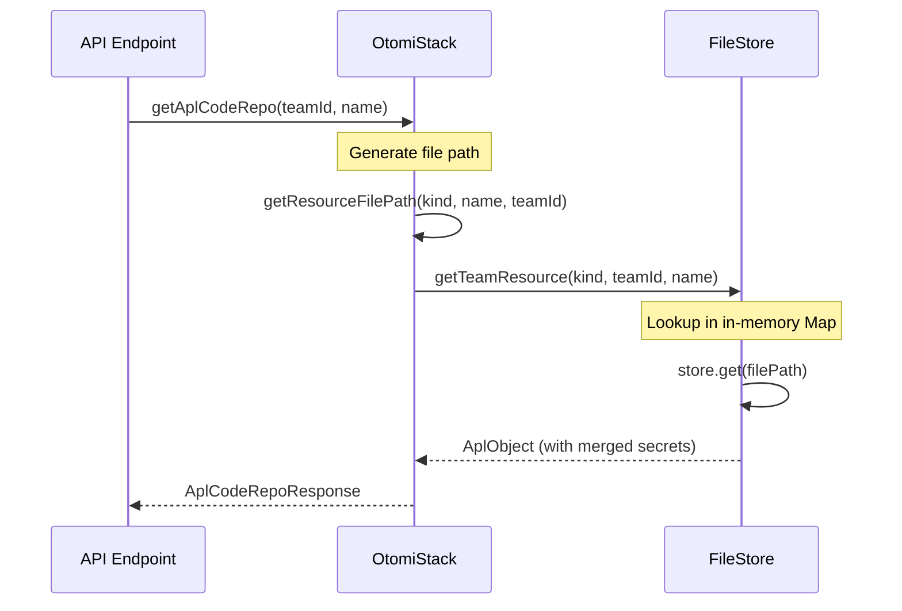

### 3.3 UPDATE Flow

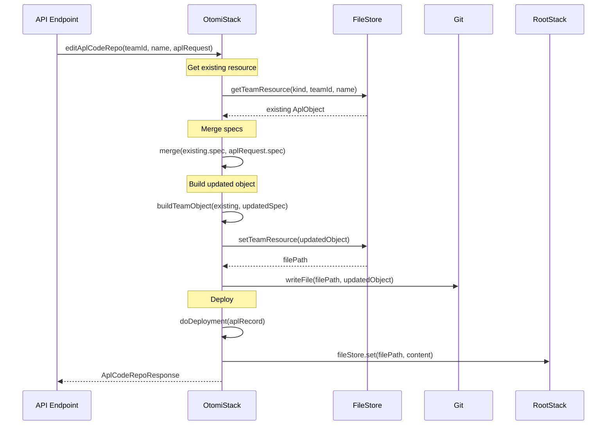

### 3.4 DELETE Flow

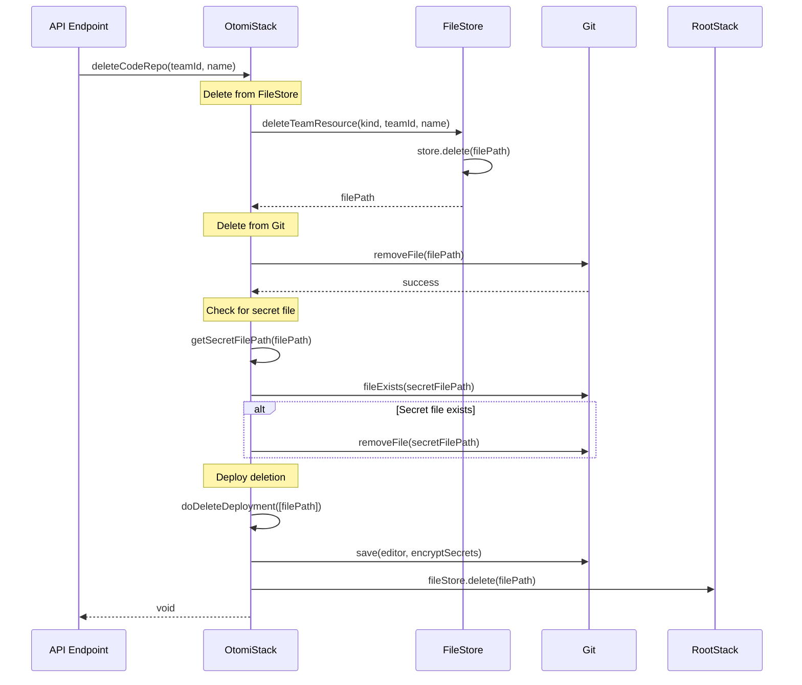

---

## 4. Secret File Handling

### 4.1 Secret Extraction and Storage

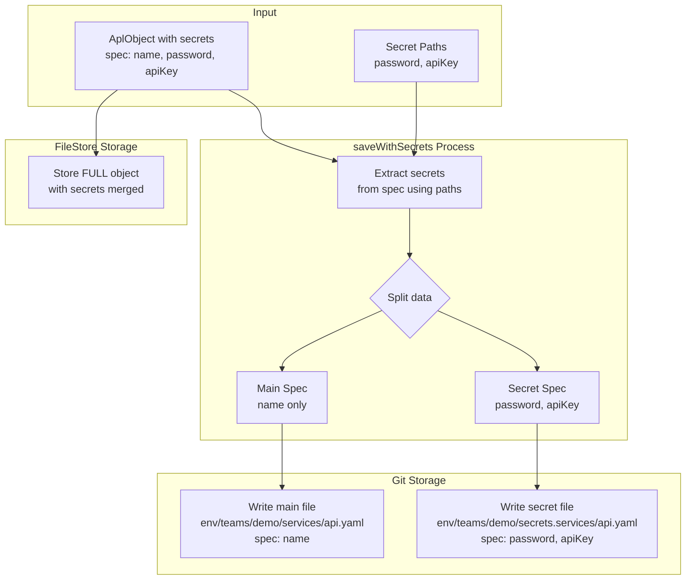

### 4.2 Secret Path Extraction Functions

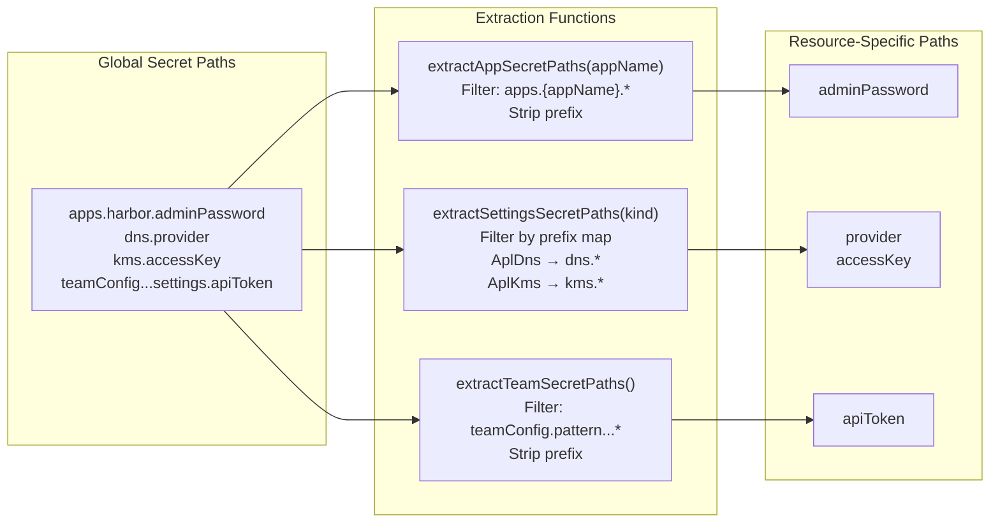

### 4.3 Secret Merge During Load

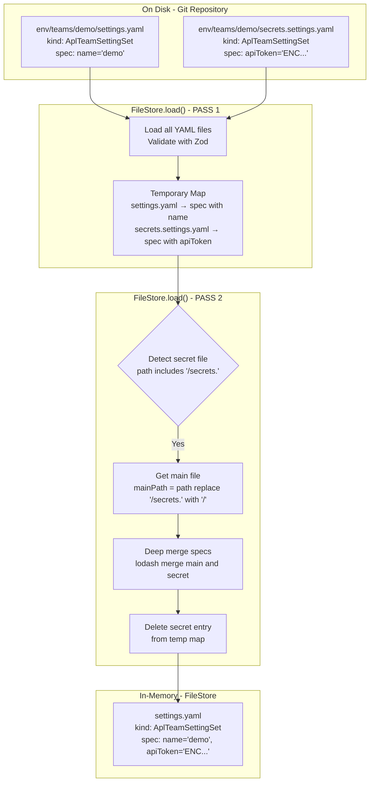

---

## 5. FileStore Load Process

Complete two-pass loading and merging process.

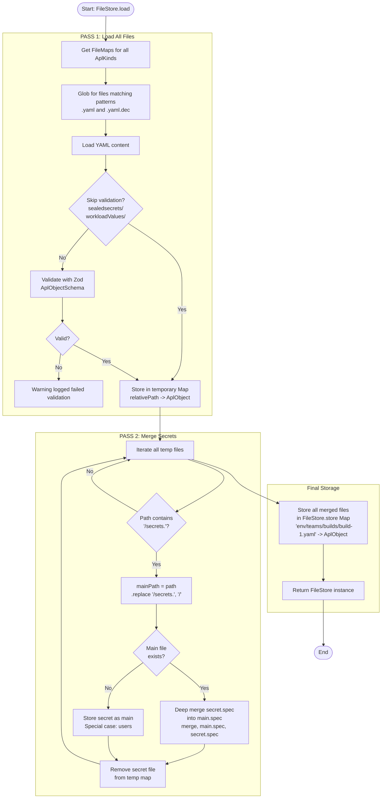

---

## 6. File Path Generation

### 6.1 Path Generation Process

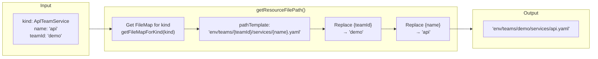

### 6.2 Secret File Path Derivation

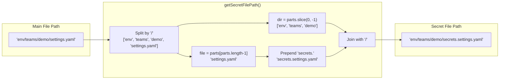

---

## Key Takeaways

### In-Memory vs On-Disk
- **FileStore (In-Memory)**: Stores complete objects with secrets merged. Fast access for all operations.
- **Git (On-Disk)**: Stores main files without secrets + separate secret files. Version controlled and encrypted.

### Object Transformation Pattern
```
V2 API: AplRequest → AplTeamObject → FileStore → AplResponse
                     (add label)    (store)      (retrieve)
```

### Secret Handling Pattern
```
Write: Split secrets → Main file + Secret file (on disk)
Load: Merge secrets → Complete object (in memory)
Access: Always use FileStore (has merged secrets)
```

### CRUD Pattern
```
CREATE: Transform → FileStore.set → Git.writeFile → Deploy
READ:   FileStore.get → Transform
UPDATE: Get → Merge → FileStore.set → Git.writeFile → Deploy
DELETE: FileStore.delete → Git.removeFile → Deploy
```
