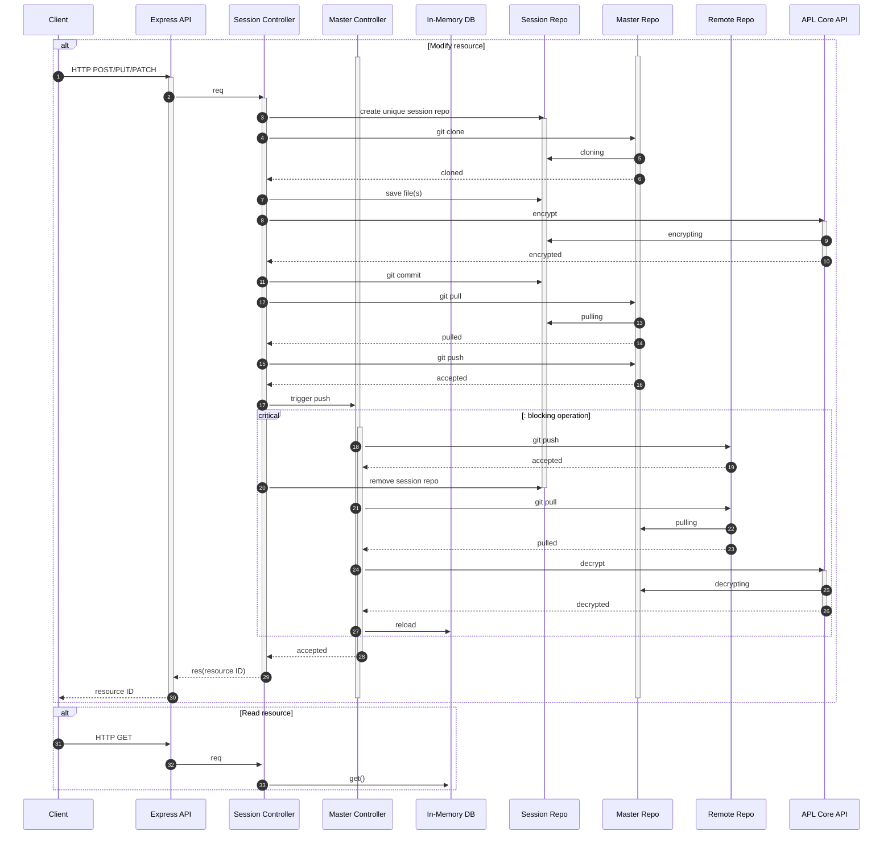

# REST API and GitOps

The below diagram depicts what happens with each request that modifies the values repository.

The `Session Repo` and Session Controller are created on each HTTP POST/PUT/PATCH requests that aims modifying gitops repo (i.e. values repo). The `Session Repo` is a local clone of the `Master repo`. The `Master repo` and `Master controller` are used to merge changes from the `Session Repo(s)`. The `In-Memory DB` serves as cache made out of `Master repo`. The `APL Core API` containes tools to perform SOPS encryption on files both `Session repos` and `Master repo`.

