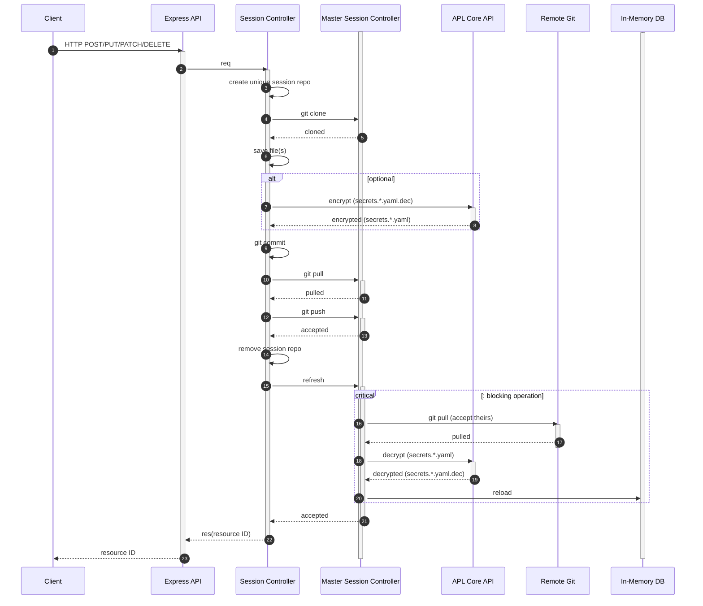
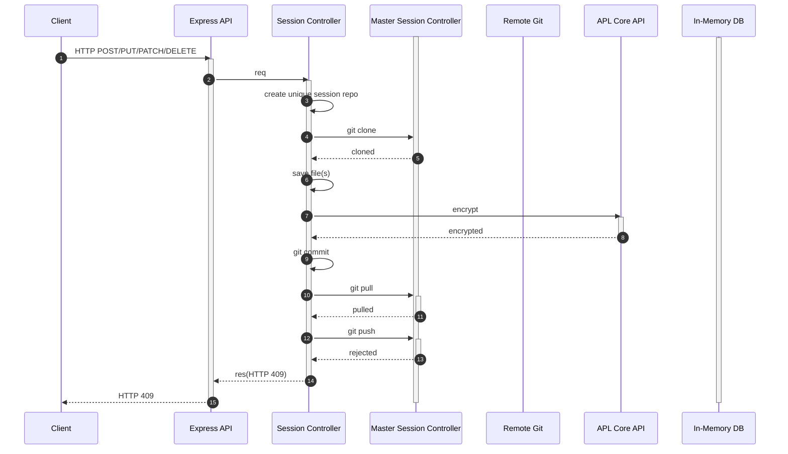
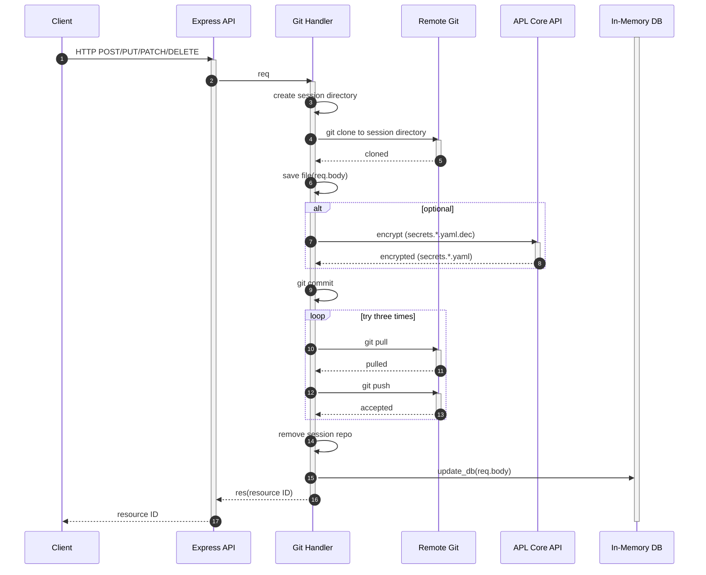
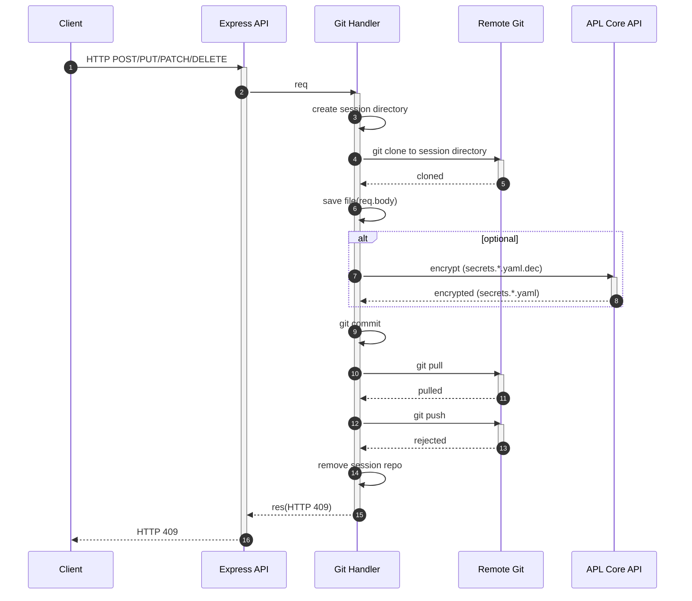
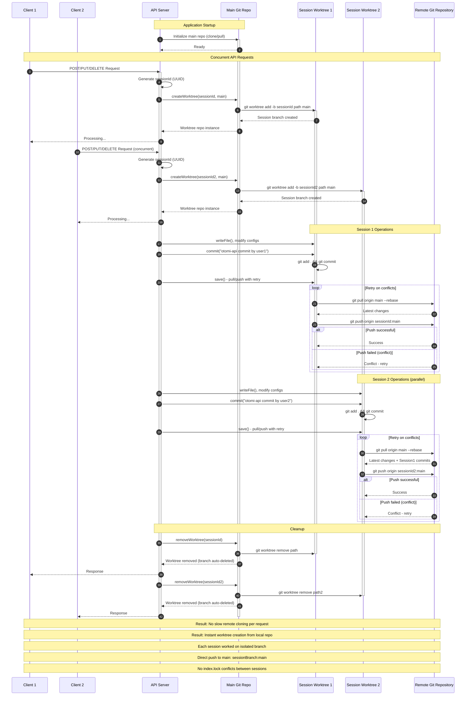

# REST API and GitOps

## Version one

**Sequence diagram for the accepted request**

The below diagram depicts what happens with each request that modifies the values repository.

The `Session Controller` is created on each HTTP POST/PUT/PATCH and DELETE requests that aims modifying gitops repo (i.e. values repo). The `Session Controller` is a local clone of the `Master session controller`. The `In-Memory DB` serves as cache made out of `Master session controller`. The `APL Core API` contains tools to perform SOPS encryption on files in both `Session Controller` and `Master session controller`.

There is a critical section that introduces locking mechanism. The locking mechanism ensures that single git operation (merge) happens on the `Master session controller` at the time.

**Sequence diagram for the rejected request**

## Version two

The locking mechanism is removed by removing the master session controller concept. The session repo controller pulls and pushes from/to Git instead of master repo. The Session Controller is also renamed to `Git handler` to not confuse it with user session.

**Sequence diagram for the accepted request**
The following diagram presents GitOps without locking mechanism. It is worth noting that is performs eight operations less comparing to its predecessor.
An important change is made to Session Controller, which is updating the In-memory DB. This operation is needed to ensure that GET requests can obtain the updated resources.

The loop form in the diagram indicates that some concurrent pushes can still occur,and that apl-api may need to retry the git operations. However it is not a blocking operation for any other HTTP request.
The encryption is an optional step, depending on secrets being modified or not.

**Sequence diagram for the rejected request**

## Version three - Git Worktrees

The git worktrees implementation eliminates the performance bottleneck of cloning from remote repository for each request. Instead, a main repository is maintained locally and git worktrees are created for each session. This provides instant session creation while maintaining complete isolation between concurrent operations.

**Key improvements:**
- Main repository cloned once at startup, eliminating remote clone overhead
- Git worktrees created instantly from local main repository
- Each session operates on an isolated branch with independent `.git/index.lock` files
- Direct push from session branch to main branch on remote
- Automatic cleanup of worktrees and branches after completion
- No blocking operations between concurrent sessions due to isolated git indexes

**Git Index Isolation:**
Version two avoided `.git/index.lock` conflicts by cloning the entire repository from remote to separate directories for each session. While this provided isolation, it created a significant performance bottleneck due to repeated remote cloning.

Git worktrees provide the same isolation benefits but with instant creation from a local repository:
- Main repo: `.git/index` and `.git/index.lock`  
- Worktree 1: `.git/worktrees/sessionId1/index` and `.git/worktrees/sessionId1/index.lock`
- Worktree 2: `.git/worktrees/sessionId2/index` and `.git/worktrees/sessionId2/index.lock`

This maintains the concurrency benefits of version two while eliminating the remote cloning performance penalty.
