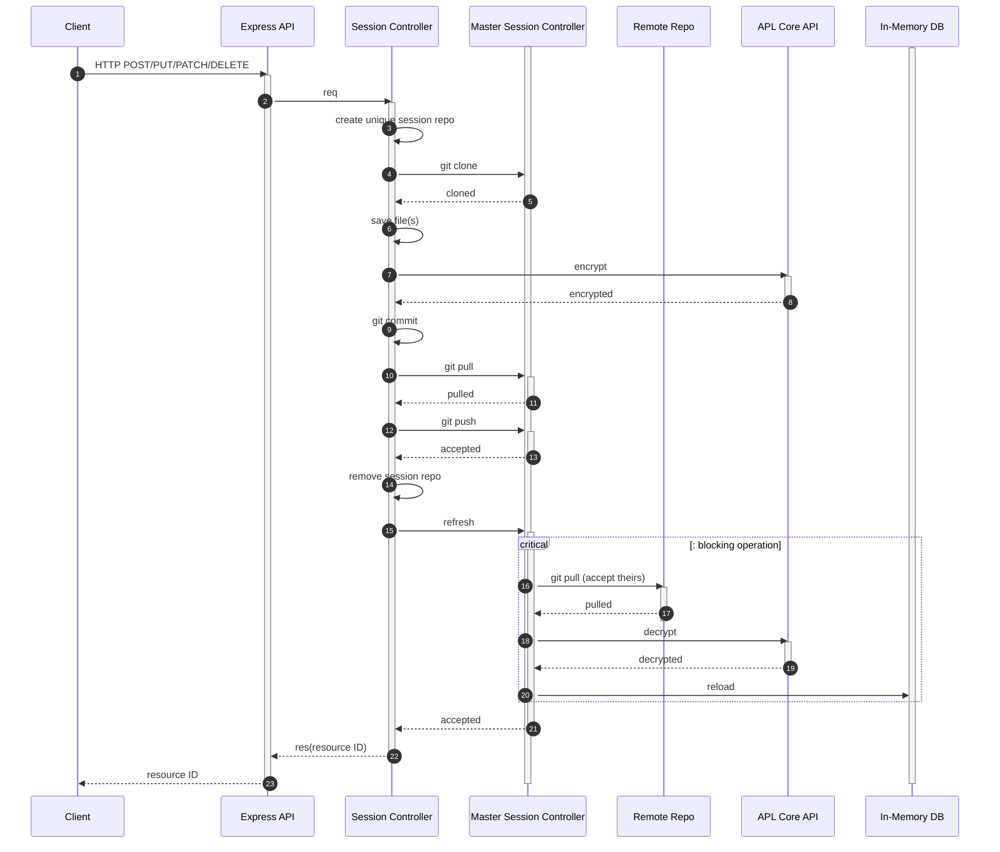
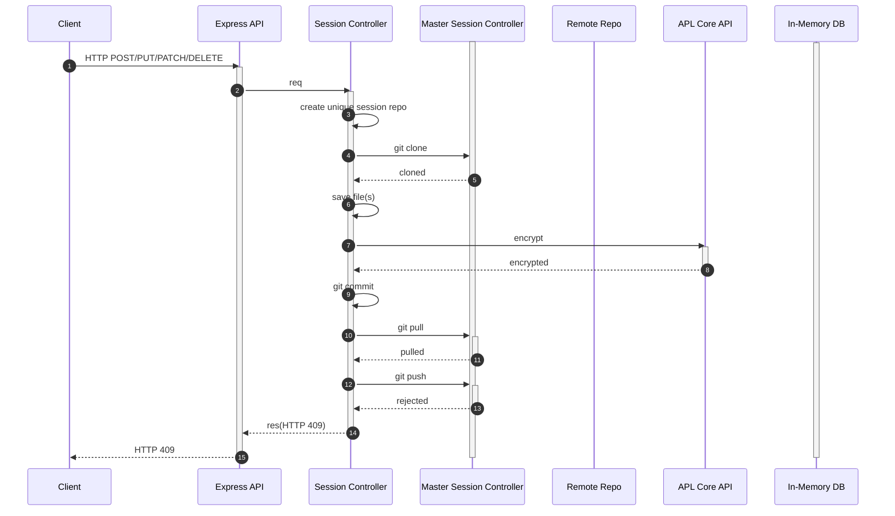
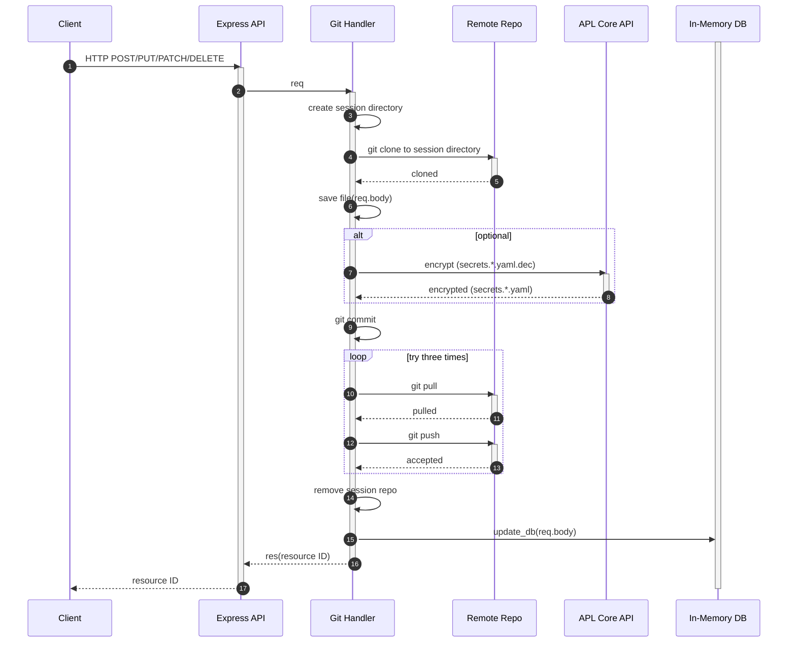
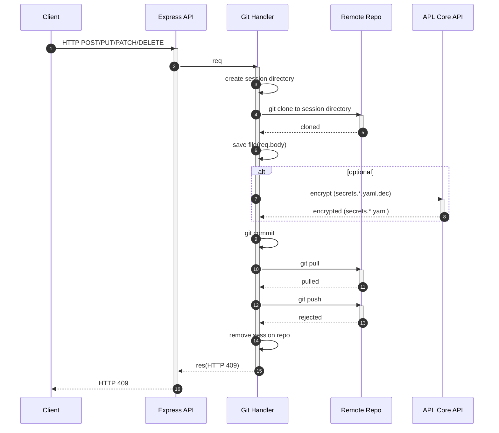

# REST API and GitOps

## Version one

**Sequence diagram for the accepted request**
The below diagram depicts what happens with each request that modifies the values repository.

The `Session Repo` and Session Controller are created on each HTTP POST/PUT/PATCH and DELETE requests that aims modifying gitops repo (i.e. values repo). The `Session Repo` is a local clone of the `Master repo`. The `Master repo` and `Master controller` are used to merge changes from the `Session Repo(s)`. The `In-Memory DB` serves as cache made out of `Master repo`. The `APL Core API` contains tools to perform SOPS encryption on files in both `Session repos` and `Master repo`.

There is a critical section that introduces locking mechanism. The locking mechanism ensures that single git operation (merge) happens on the master repo at the time.

**Sequence diagram for the rejected request**

## Version one

The locking mechanism is removed by removing the master session controller concept. The session repo controller pulls and pushes from/to Gitea instead of master repo.
**Sequence diagram for the accepted request**
The following diagram presents GitOps without locking mechanism. It is worth noting that is performs eight operations less comparing to its predecessor.
An important change is made to Session Controller, which is updating the In-memory DB. This operation is needed to ensure that GET requests can obtain the updated resources.

The loop form in the diagram indicates that some concurrent pushes can still occur,and that apl-api may need to retry the git operations. However it is not a blocking operation for any other HTTP request.
The encryption is an optional step, depending on secrets being modified or not.

**Sequence diagram for the rejected request**

